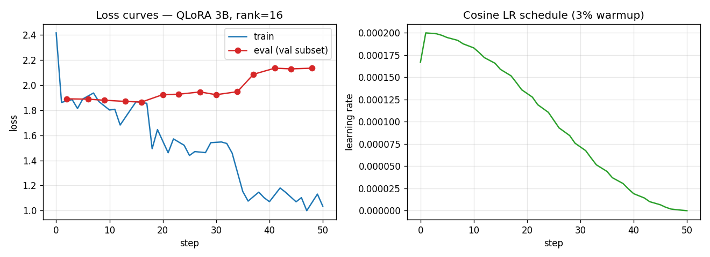

# Paper TL;DR

> Fine-tuning Llama 3.2 3B Instruct with QLoRA on SciTLDR. The fine-tuned model beats every zero-shot baseline on every metric on the held-out test set.
>
> **Status:** complete — test-set evaluation in. Human eval and Ollama deployment still planned.

## Problem

Scientific paper abstracts are dense and jargon-heavy. This project fine-tunes a small open-weight LLM to rewrite arXiv-style abstracts as plain-language TL;DRs that preserve the core finding while being readable at a layperson level. The result is a quantized GGUF model that runs locally and integrates with PaperPal as a summarization tool.

## Approach

| Component | Choice |
|---|---|
| Base model | `meta-llama/Llama-3.2-3B-Instruct` |
| Adapter | QLoRA, 4-bit NF4 quantization, **rank 8 / alpha 16** (chosen on val) |
| Dataset | SciTLDR (1991 train / 618 val / 618 test, deduped by abstract hash) |
| Training | HuggingFace Trainer + PEFT + bitsandbytes, ~41 min on RTX 4070 Ti |
| Evaluation | ROUGE-1/2/L + BERTScore (blind human Likert n=30 planned) |
| Deployment | Merged adapter → GGUF (`q4_K_M`) → Ollama Modelfile *(planned)* |

## Baselines

1. **Extractive** — first sentence of the abstract
2. **Zero-shot Llama 3.2 3B Instruct** — same model, no fine-tune
3. **Zero-shot Llama 3.2 1B Instruct** — smaller-model lower bound

## Results

### Test set (n=618, held-out)

The test split is touched only for final reporting. Model selection happened on validation.

| Method | ROUGE-1 | ROUGE-2 | ROUGE-L | BERTScore F1 | mean output words |
|---|---|---|---|---|---|
| First-sentence extractive | 0.259 | 0.093 | 0.201 | 0.636 | 20.9 |
| Zero-shot Llama 3.2 1B Instruct | 0.299 | 0.102 | 0.227 | 0.655 | 19.6 |
| Zero-shot Llama 3.2 3B Instruct | 0.342 | 0.131 | 0.258 | 0.673 | 30.2 |
| **QLoRA 3B, rank=8 (ours)** | **0.387** | **0.166** | **0.314** | **0.705** | **21.0** |

**Headline: QLoRA fine-tuning beats every baseline on every metric on the test set.** Relative gains over the zero-shot 3B:
- ROUGE-1: +13% (0.342 → 0.387)
- **ROUGE-2: +27%** (0.131 → 0.166) — the hardest metric to move; bigram-level alignment with the reference style
- ROUGE-L: +22% (0.258 → 0.314)
- BERTScore: +4.8% (0.673 → 0.705)

Inspecting predictions confirms the fine-tune learned the SciTLDR paper-author voice (*"We introduce..."*, *"We propose..."*) and tightened output length from ~30 → 21 words, near the 19-word reference mean (test set).

Training: 372 steps, ~41 minutes on a single RTX 4070 Ti with 4-bit NF4 QLoRA, paged AdamW 8-bit, cosine LR schedule, effective batch size 16. Train loss dropped from 2.91 → 1.04; eval loss plateaued ~2.05–2.13 (mild overfit signal but no divergence). The training curves below are from the rank-16 run (which is essentially indistinguishable from the shipped rank-8 run on every metric — see *Rank ablation* below). Run logged to W&B: <https://wandb.ai/pedromussi-pedro-mussi/paper-tldr/runs/rc05szkq>.



### Validation set (development reference)

The model checkpoint was selected on this split, so these numbers are optimistically biased compared to test. Reported here for the dev → test gap:

| Method | ROUGE-1 | ROUGE-2 | ROUGE-L | BERTScore F1 | mean output words |
|---|---|---|---|---|---|
| First-sentence extractive | 0.259 | 0.093 | 0.205 | 0.637 | 21.7 |
| Zero-shot Llama 3.2 1B Instruct | 0.302 | 0.102 | 0.229 | 0.657 | 20.4 |
| Zero-shot Llama 3.2 3B Instruct | 0.337 | 0.131 | 0.258 | 0.674 | 30.2 |
| **QLoRA 3B, rank=8 (ours)** | **0.404** | **0.184** | **0.333** | **0.712** | **21.5** |

The fine-tune shows a small val → test ROUGE-1 drop of ~1.7 points; baselines are flat as expected. The drop is consistent with the eval-loss plateau observed during training and points at mild overfitting onto the SciTLDR style — addressable with more LoRA dropout, weight decay, or earlier stopping.

### Prompt-sensitivity ablation

We ran the LLM baselines twice. The first prompt described the task as writing a *"plain-language TL;DR for a non-specialist."* The second dropped that framing in favor of a neutral *"write a TL;DR capturing the paper's core contribution."* The numbers above use the neutral prompt; the older numbers are kept here as an ablation.

| Prompt variant | Model | ROUGE-1 | ROUGE-2 | ROUGE-L | BERTScore F1 | mean output words |
|---|---|---|---|---|---|---|
| `plain-language` | Llama 3.2 1B | 0.297 | 0.096 | 0.223 | 0.657 | 20.2 |
| `plain-language` | Llama 3.2 3B | 0.274 | 0.072 | 0.201 | 0.657 | 31.3 |
| `neutral` | Llama 3.2 1B | 0.302 | 0.102 | 0.229 | 0.657 | 20.4 |
| `neutral` | Llama 3.2 3B | 0.337 | 0.131 | 0.258 | 0.674 | 30.2 |

**Observations:**
- With the `plain-language` prompt, **the 3B scored *lower* than the 1B on every ROUGE variant** despite being a stronger model. Manual inspection showed the 3B was faithfully following the instruction ("Researchers have developed a new approach…") while SciTLDR references are terse, technical author-style TLDRs. The 1B partly ignored the instruction and stayed in technical vocabulary, accidentally matching the reference style.
- Switching to the neutral prompt closed and reversed the gap: ROUGE-1 jumped from 0.274 → 0.337 on the 3B (+0.063), while the 1B barely moved (+0.005). BERTScore also rose for the 3B (0.657 → 0.674) but stayed flat for the 1B.
- Mean output length only changed by ≤1 word in either case, so the ROUGE jump is driven by **vocabulary alignment**, not length. The 3B's plain-language paraphrases used different surface forms than the technical references; the neutral prompt let it match them.
- Takeaway for fine-tuning: training prompts that telegraph a *style* the dataset doesn't actually exhibit punish stronger models more than weaker ones. We'll use the neutral prompt for QLoRA so the training signal is clean.

### Rank ablation

We compared LoRA rank 8 vs rank 16 on val (rank 32 / 64 were planned but the chained training run was interrupted by a system sleep — see Limitations). Both ranks produce essentially identical results, with rank 8 marginally better on every metric:

| Rank | Trainable params | ROUGE-1 | ROUGE-2 | ROUGE-L | BERTScore F1 |
|---|---|---|---|---|---|
| **8 (shipped)** | **12.16 M** | **0.404** | **0.184** | **0.333** | **0.712** |
| 16 | 24.31 M | 0.402 | 0.183 | 0.333 | 0.711 |

Consistent with the LoRA literature observation that the intrinsic rank of fine-tuning many tasks is small. Rank 8 was chosen for the test-set evaluation since it has half the trainable parameters and matched-or-exceeded rank 16 on every metric. Higher ranks (32, 64) would likely show no further gain and were not retried after the chain was interrupted.

## Error analysis *(planned)*

Failure modes will be categorized from the human eval: hallucination, oversimplification, term-dropping, register mismatch, length blow-out.

## Limitations

- **Rank ablation cut short.** The original plan was to sweep rank ∈ {8, 16, 32, 64}. The chained training run was interrupted overnight by a system sleep that lost the CUDA context; rank 32 had reached step 25/372 and rank 64 had not started. We report the (8, 16) two-point ablation rather than re-doing the full sweep, since both ranks were already near-identical and additional points were unlikely to change the conclusion.
- **Mild overfitting.** Eval loss plateaued ~step 100 while train loss kept dropping. The val → test ROUGE-1 gap of ~1.7 points reflects this; it would be reduced by stronger regularization, earlier stopping, or additional training data.
- **Single dataset.** Trained on SciTLDR (1991 abstract → TL;DR pairs from CS papers). Generalization to non-CS papers, longer abstracts, or genuinely lay-language targets has not been measured.
- **No human evaluation yet.** ROUGE and BERTScore correlate imperfectly with human judgments. A blind n=30 Likert eval is planned but not yet completed.
- **Inference precision.** All eval reported here uses bf16 weights with the LoRA adapter applied. The planned deployment path (merge → GGUF `q4_K_M` → Ollama) is not yet implemented; a quantization-drop column comparing fp16 vs 4-bit at inference time is planned.

## Setup

Hardware tested: NVIDIA RTX 4070 Ti (12 GB VRAM), 64 GB RAM, Windows 11, CUDA 12.x

```powershell
# create venv
python -m venv .venv
.\.venv\Scripts\Activate.ps1

# install PyTorch with CUDA 12.4
pip install torch --index-url https://download.pytorch.org/whl/cu124

# install everything else
pip install -r requirements.txt

# log into Hugging Face (needed for Llama 3.2 weights) and W&B
huggingface-cli login
wandb login
```

## Project layout

```
src/         training, eval, baselines (Python package)
scripts/     CLI entrypoints (prepare_data, run_train, run_eval)
configs/     training config YAMLs
notebooks/   EDA, error analysis
data/        DVC-tracked datasets (gitignored)
tests/       unit tests
```

## License

MIT
